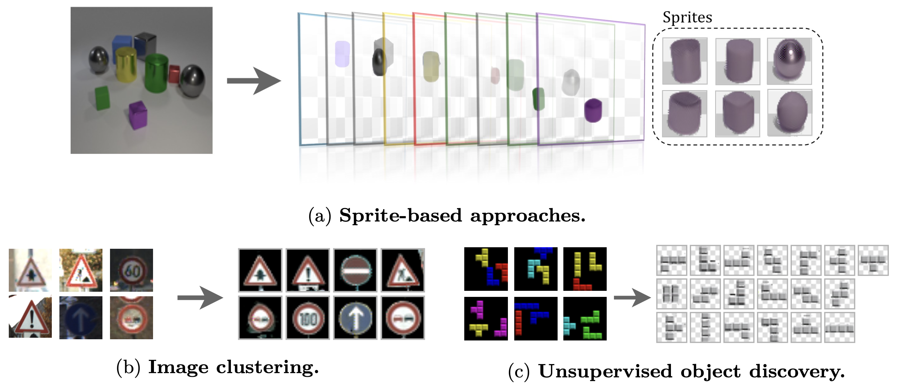

# Deep Sprite-based Image Models: An Analysis

<div align="center">
<p align="justify">
Official repository of the paper <i>"Deep Sprite-based Image Models: An Analysis"</i>. In this work, we focus on <b>sprite-based image decomposition models</b>, diving into the details of their design, identify their core components, and perform an extensive analysis on clustering benchmarks. We leverage this analysis to propose a deep sprite-based image decomposition method that performs on par with state-of-the-art unsupervised class-aware image segmentation methods on the standard CLEVR benchmark, scales linearly with the number of objects, identifies explicitly object categories, and fully models images in an easily interpretable way.
</p>

</div>

## Setup :construction:
### Environment
This project uses `uv`. To setup the environment:

1. Install `uv`.

```
# for macOS/Linux
curl -LsSf https://astral.sh/uv/install.sh | sh
```

2. Run the following command in the project root. This will create a virtual environment and install all dependencies automatically.

```
uv sync
```

3. To run the code in the environment, either activate the environment as follows:

```
source .venv/bin/activate
```

or add `uv run` before your training command.

### Datasets
```
./download_data.sh
```

This command will download following datasets:

- `affNIST` (original repository: [link](https://www.cs.toronto.edu/~tijmen/affNIST/))
- `Tetrominoes`, `Multi-dSprites`, `CLEVR6` and `CLEVR` (original repository: [link](https://github.com/deepmind/multi_object_datasets/))
- `GTSRB` (original repository: [link](https://benchmark.ini.rub.de/gtsrb_dataset.html))

## Training :gear:
To train a model, following command can be adapted with corresponding `config` files and the task:
```
python -m src.<task>_trainer +dataset=<dataset_config> +model=<task>/<model_config> +training=<task>/<training_config> ++hydra.job.name=<experiment_name>
```

where `<task>` $\in$ {`clustering`, `multilayer`}.

As an example, the following command trains a sprite-based clustering model for MNIST:

```
python -m src.clustering_trainer +dataset=mnist +model=clustering/mnist +training=clustering/mnist ++hydra.job.name=mnist_clustering
```

and the following command trains a sprite-based multi-layer model for CLEVR:

```
python -m src.multilayer_trainer +dataset=clevr +model=multilayer/clevr +training=multilayer/mnist ++hydra.job.name=clevr_multilayer
```

### Additional information for `config` file configurations
- Since our repository is built upon `hydra`, any hyperparameter for both the model and the training pipeline can be overwritten with `++<hyperparameter_name>` through the command line.
- Under `conf/`, if a model or training setup configuration filename ends with `_dti`, the setup corresponds to the baselines (Monnier et al., 2020) and (Monnier et al. 2021). Additionally, `_long` suffix to `_dti` corresponds to longer training of the baseline to have a fair comparison with our model.

## Citation :bookmark:
```
@misc{baltacı2026deepsprite,
      title={Deep sprite-based image models: An analysis}, 
      author={Zeynep Sonat Baltacı and Romain Loiseau and Mathieu Aubry},
      year={2026},
      eprint={2604.19480},
      archivePrefix={arXiv},
      primaryClass={cs.CV},
      url={https://arxiv.org/abs/2604.19480}, 
}
```

## Acknowledgements
Z. S. Baltacı and M. Aubry supported by the ANR project VHS ANR-21-CE38-0008, and the ERC project DISCOVER funded by the European Union's Horizon Europe Research and Innovation program under grant agreement No. 101076028. This work was granted access to the HPC resources of IDRIS under the allocation AD011015415R1, AD011015415, and AD011014404 made by GENCI. We would like to thank Ioannis Siglidis for insightful discussions, and Robin Champenois and Ségolène Albouy for their contributions to the codebase.

This repository is built upon the open-source repositories of [DTI-Sprites](https://github.com/monniert/dti-sprites) (Monnier et al., 2021) and [DTI-Clustering](https://github.com/monniert/dti-clustering) (Monnier et al., 2020). If you are interested in the background or the original implementation of these methods, we highly recommend visiting their repositories and exploring the associated research papers.
